# 📌 512 Point Radix-2² FFT Design

### 🎯 프로젝트 개요
전반적인 Front-End 과정을 진행했습니다.
- MATLAB을 활용해 Radix-2 FFT의 Butterfly 구조를 이해
- Floating-Point와 Fixed-Point 차이를 분석
- BFP와 CBFP를 적용한 알고리즘을 분석
- 소프트웨어 모델링을 기반으로 하드웨어 모듈을 설계
- Synopsys EDA Tool을 이용해 RTL 및 Gate Level 검증.
- Vivado를 통한 Bitstream생성
---

### 🙋‍♂️ 역할 분담

#### 🐲윤종민
- Butterfly 설계 및 검증, Top Merge
#### 🦖이현수
- CBFP, Mag detect 설계 및 검증 
#### 🐉이은성
- Butterfly 설계 및 검증, Top Merge
#### 🥊장환
- Shift Register 설계 및 검증, 합성

---

### 💻 개발 환경

| 구분        | 사용 도구 / 언어 |
| :-----: | :-----: |
| **EDA Tools** | Xilinx Vivado HLx Editions, Synopsys VCS, Synopsys Verdi, Synopsys Design Compiler |
| **Languages** | SystemVerilog, MATLAB |
| **IDE / Tools** | Visual Studio Code, MobaXterm |

---

### 📂 프로젝트 구조

```
FFT-Design/
├── docs/            # 설계 보고서, 참고 자료
├── software/        # 알고리즘 검증
├── hardware/   
│    ├── rtl/        # SystemVerilog 설계 소스
│    ├── sim/        # RTL Level 합성
│    ├── syn/        # 합성 스크립트 및 리포트
│    ├── verilog/    # Gate Level 합성
│    └── testbench/  # 시뮬레이션 테스트벤치
└── README.md
```

---

### 🔎 알고리즘 검증

📂 [참고문헌](./Docs)

**✨ Input Vertor 생성**
| cos_in_gen | ran_in_gen |
| :---: | :---: |
| 코사인 함수의 복소수 벡터 및 고정소수점으로 양자화된 벡터 | 랜덤 함수의 복소수 벡터 및 고정소수점으로 양자화된 벡터 |

**🆚  Floating Point vs Fixed Point**
| fft_float | fft_fixed |
| :-----: | :-----: |
| 범위가 넓고 소수점 이동 가능, 정밀도 높음 | 정해진 비트로 표현, 연산 빠르고 하드웨어 효율적이지만 오버플로우/정밀도 제한 있음 |

**🆚 BFP vs CBFP**
| 구분 | BFP (Block Floating Point) | CBFP (Convergent Block Floating Point) |
| :---: | :---: | :---: |
| **방식** | 블록 내 최대값 기준으로 shift 수행 | 여러 조건(real/imag, max/min 등) 고려해 지수 결정 |
| **블록 처리** | 전체 블록 단위 | 세분화된 블록 단위 (N/4, N/8, N/16 …) |
| **정밀도** | 큰 값에 의해 작은 값이 underflow → 손실 가능 | 블록마다 다른 지수 사용 가능 → underflow 감소 |
| **파이프라이닝** | 블록 전체를 알아야 함 → 어려움 | 블록 단위로 가능 → 파이프라이닝 유리 |
| **성능** | 기준 성능 | BFP 대비 약 **+0.5 dB 향상** |
| **적합한 경우** | 단순 구현, 하드웨어 복잡도 낮음 | 정밀도 중요, 다양한 신호(OFDM, Dirac 등) 입력 시 효과적 |


**➕ BIT 계산**
| module0                     | module1                          | module2                          |
|-----------------------------|----------------------------------|----------------------------------|
| <3.6> din (9bits)           | bfly02 (11 bits)                 | bfly12 (12 bits)                 |
| ↓ (bfly00)                  | ↓ (bfly)                         | ↓ (bfly)                         |
| <4.6> (10bits)              | bfly10 (12 bits)                 | bfly20 (13 bits)                 |
| ↓ (bfly01)                  | ↓ (bfly)                         | ↓ (bfly)                         |
| <5.6> * <2.8> (TW)           | bfly11 (13 bits) * TW<2.8>       | bfly21 (14 bits) * TW<2.8>       |
| ↓                           | ↓                                | ↓                                |
| <7.14> (21bits)             | 23bits                           | 24bits                           |
| ↓ (/256 = <<2^8)             | ↓ (/256 = <<2^8)                  | ↓ (/256 = <<2^8)                  |
| <7.6> (13bits)              | bfly11 (15bits)                  | bfly21 (16bits)                  |
| ↓ (bfly02)                  | ↓ (bfly)                         | ↓ (bfly)                         |
| <8.6> (14bits)              | bfly12 (16bits) * TW<2.7>        | bfly22 (17bits)                  |
| ↓ (sat)                     | ↓                                | ↓ (sat)                          |
| <7.6> × TW<2.7>             | bfly12 (25bits)                  | bfly22 (16bits)                  |
| ↓                           | ↓ (CBFP)                         | ↓ (CBFP index를 이용한 조정)      |
| <9.13>                      | bfly12 (12 bits)                 | <9.4> bfly22 (13 bits)           |
| ↓ (CBFP)                    |                                  |                                  |
| bfly02 (11 bits)            |                                  |                                  |


📂 [MATLAB 알고리즘 검증 코드](./Software)

---

### 🏗️ FFT 구조

| **Algorithm Diagram** | **FFT Block Diagram** |
| :-----------: | :-----------: |
|  |  |

---

### 🔎 검증 및 시뮬레이션

🔎 **RTL Level 검증 (Synopsys 시뮬레이션)**
1. Synopsys Verdi를 통해 RTL Level FFT 동작 확인<br>
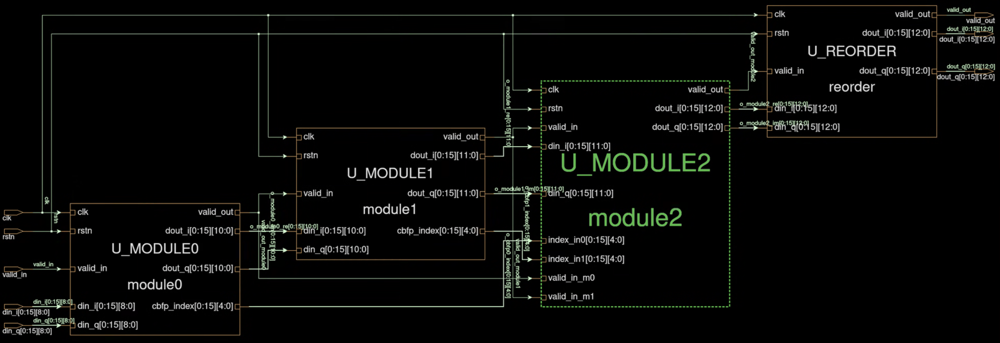

2. MATLAB에서 각 버터플라이 단계별 출력 값 추출<br>

```matlab
fp_cos_fft_output = fopen('cos_fft_output.txt','w');
for nn=1:512
    fprintf(fp_cos_fft_output, '%d %d\n',  real(bfly22(nn)), imag(bfly22(nn)));
end
fclose(fp_cos_fft_output);
```

3. RTL 시뮬레이션 결과와 MATLAB 값 비교<br>

```bash
diff cos_fft_output.txt fft_output.txt
```
| RTL Simulation | Text File |
|:---:|:---:|
| 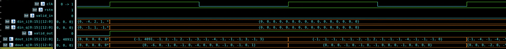 | 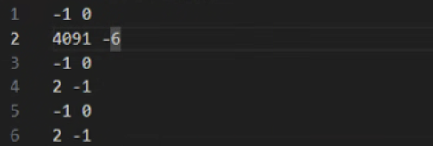 |
| 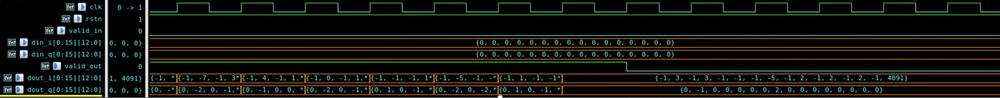 | 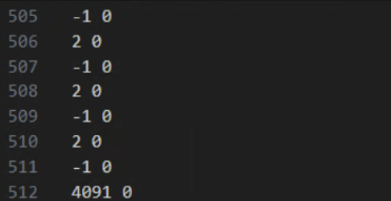 |


=> 각 단계별 일치 여부를 확인하여 모듈의 정확성 검증
 
---

🔎 **Gate Level 검증 (Synopsys 시뮬레이션)** 
1. Synopsys Design Compiler를 통해 NetList생성
2. Synopsys Verdi를 통해 Gate Level FFT 동작 확인
   
| Gate Simulation | Text File |
|:---:|:---:|
| 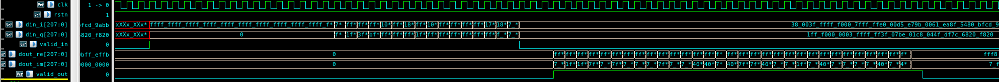 |  |

3. 면적(area), 타이밍(timing) 분석

| Area | Slack |
|:---:|:---:|
| 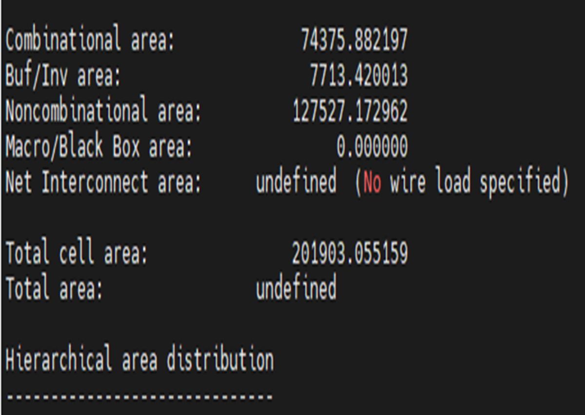 | 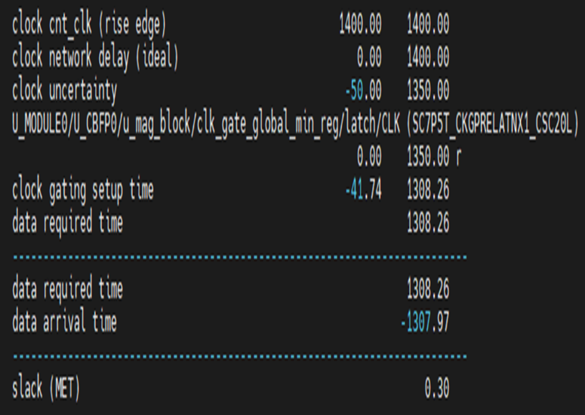 |

4. MATLAB 버터플라이 단계별 결과와 비교
=> RTL Level 결과와 동일

=> 실제 하드웨어 구현과 일치하는지 검증

---

🔎 **FPGA 검증 (Vivado 시뮬레이션)**
1. Vivado 시뮬레이션으로 FPGA에서의 RTL 동작 확인

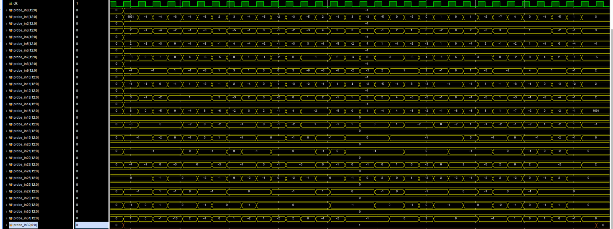

2. MATLAB 버터플라이 단계별 값과 비교하여 정확성 검증
=> RTL Level 결과와 동일

3. BitStream 생성

| Bitstream | Resource |
|:---:|:---:|
|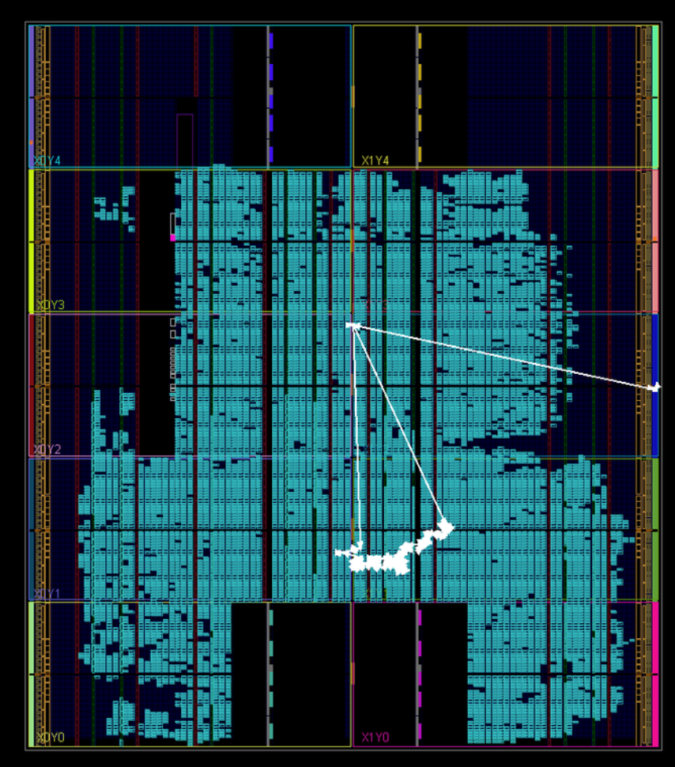|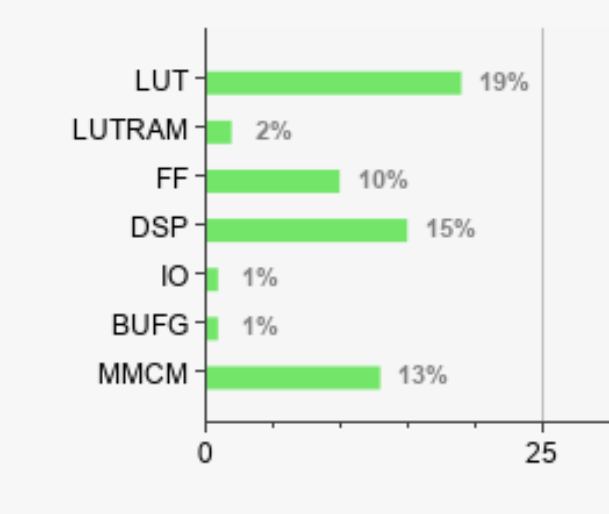| 


=> BitStream을 통해 FPGA Resource와 타이밍 slack을 확인하여 하드웨어 구현 가능성을 검증

---

### 🛠️ Trouble Shooting

---

### 🧠 고찰 및 개선 점

```
Area 개선
Clock 줄이기
Code 최적화
```
---


